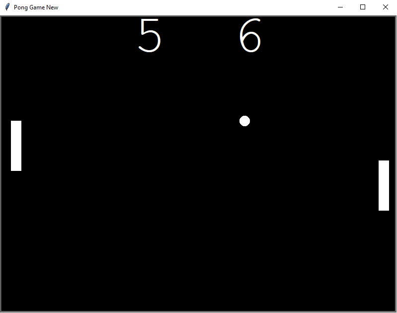

# Pong Game

Welcome to the Pong Game! This is a classic arcade-style game where two players control paddles to hit a ball back and forth. The goal is to score points by getting the ball past your opponent's paddle.

## How to Play
1. Player 1 (right side) controls the paddle using the Up and Down arrow keys.
2. Player 2 (left side) controls the paddle using the W and S keys.
3. The game starts with the ball moving towards the opponent's side.
4. Use the paddles to hit the ball back towards your opponent.
5. Score a point by getting the ball past your opponent's paddle.
6. The game ends when one player reaches a set number of points (default is 5).

## Features
- Two-player gameplay: play against a friend or the computer.
- Adjustable game speed: control the speed of the ball and paddles.
- Scoreboard: keep track of each player's score during the game.
- Game over screen: display the winner and option to play again.

## Files
- `pong_game_play.py`: Main game script that initializes the game and handles game logic.
- `paddle.py`: Paddle class that defines the behavior of the paddles.
- `pongball.py`: PongBall class that defines the behavior of the ball.
- `scoreboard.py`: Scoreboard class that tracks and displays the player's score.

## Usage
1. Run the `pong_game_play.py` file using a Python interpreter.
2. Use the arrow keys (Player 1) or W/S keys (Player 2) to control the paddles.
3. Score points by getting the ball past your opponent's paddle.
4. The game ends when one player reaches the set number of points.

## Screenshots

## Credits
- Developed by [Supun Wickramarachchi](https://github.com/supunwickramarachchi).
- Inspired by the classic Pong game.

Feel free to customize this game, add more features, or improve the interface. Have fun playing Pong!
